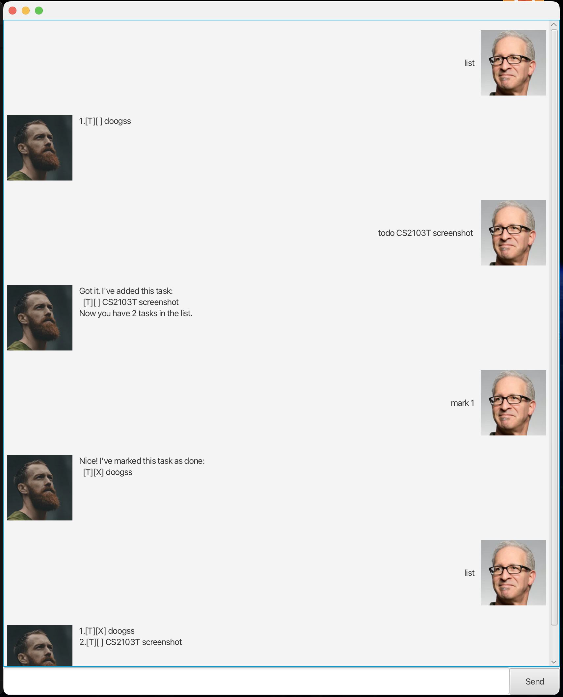

# Wader User Guide



Wader is a personal task management chatbot that helps you organize and track your tasks efficiently. Whether you need to manage simple todos, important deadlines, or scheduled events, Wader has got you covered!

## Quick Start

1. Ensure you have Java 17
2. Download the latest `Wader.jar` from the releases page
3. Double-click the jar file to start the application
4. Type commands in the text box and press Enter to interact with Wader
5. Refer to the Features section below for details on each command

## Features

### Adding a Todo Task: `todo`

Adds a simple task without any date or time.

**Format:** `todo DESCRIPTION`

**Example:** `todo read book`

```
Got it. I've added this task:
  [T][ ] read book
Now you have 1 task in the list.
```

### Adding a Deadline Task: `deadline`

Adds a task with a specific deadline.

**Format:** `deadline DESCRIPTION /by DATE TIME`

- `DATE` format: YYYY-MM-DD
- `TIME` format: HH:MM

**Example:** `deadline submit assignment /by 2025-10-15 23:59`

```
Got it. I've added this task:
  [D][ ] submit assignment (by: Oct 15 2025 11pm)
Now you have 2 tasks in the list.
```

### Adding an Event Task: `event`

Adds a task with start and end times.

**Format:** `event DESCRIPTION /from DATE TIME /to DATE TIME`

- `DATE` format: YYYY-MM-DD
- `TIME` format: HH:MM

**Example:** `event team meeting /from 2025-10-16 14:00 /to 2025-10-16 16:00`

```
Got it. I've added this task:
  [E][ ] team meeting (from: Oct 16 2025 2pm to: Oct 16 2025 4pm)
Now you have 3 tasks in the list.
```

### Listing All Tasks: `list`

Shows all tasks in your task list.

**Format:** `list`

**Example:** `list`

```
Here are the tasks in your list:
1. [T][ ] read book
2. [D][ ] submit assignment (by: Oct 15 2025 11pm)
3. [E][ ] team meeting (from: Oct 16 2025 2pm to: Oct 16 2025 4pm)
```

### Marking a Task as Done: `mark`

Marks a task as completed.

**Format:** `mark INDEX`

- `INDEX` refers to the task number shown in the list

**Example:** `mark 1`

```
Nice! I've marked this task as done:
  [T][X] read book
```

### Unmarking a Task: `unmark`

Marks a completed task as not done.

**Format:** `unmark INDEX`

**Example:** `unmark 1`

```
OK, I've marked this task as not done yet:
  [T][ ] read book
```

### Deleting a Task: `delete`

Removes a task from your task list.

**Format:** `delete INDEX`

**Example:** `delete 2`

```
Noted. I've removed this task:
  [D][ ] submit assignment (by: Oct 15 2025 11pm)
Now you have 2 tasks in the list.
```

### Finding Tasks: `find`

Searches for tasks containing a specific keyword.

**Format:** `find KEYWORD`

**Example:** `find meeting`

```
Here are the matching tasks in your list:
1. [E][ ] team meeting (from: Oct 16 2025 2pm to: Oct 16 2025 4pm)
```

### Getting Reminders: `remind`

Shows the next 3 upcoming tasks with dates.

**Format:** `remind`

**Example:** `remind`

```
Here are your next upcoming tasks:
1. [D][ ] submit assignment (by: Oct 15 2025 11pm)
2. [E][ ] team meeting (from: Oct 16 2025 2pm to: Oct 16 2025 4pm)
```

### Exiting the Program: `bye`

Saves your tasks and exits the application.

**Format:** `bye`

**Example:** `bye`

```
Bye. Hope to see you again soon!
```

## Task Status Indicators

- `[T]` - Todo task
- `[D]` - Deadline task
- `[E]` - Event task
- `[ ]` - Task not completed
- `[X]` - Task completed

## Data Storage

Wader automatically saves your tasks to a file called `tasks.txt` in the `storage` folder. Your tasks will be restored when you restart the application.

## Command Summary

| Command  | Format                                            | Example                                                     |
| -------- | ------------------------------------------------- | ----------------------------------------------------------- |
| todo     | `todo DESCRIPTION`                                | `todo read book`                                            |
| deadline | `deadline DESCRIPTION /by DATE TIME`              | `deadline submit assignment /by 2025-10-15 23:59`           |
| event    | `event DESCRIPTION /from DATE TIME /to DATE TIME` | `event meeting /from 2025-10-16 14:00 /to 2025-10-16 16:00` |
| list     | `list`                                            | `list`                                                      |
| mark     | `mark INDEX`                                      | `mark 1`                                                    |
| unmark   | `unmark INDEX`                                    | `unmark 1`                                                  |
| delete   | `delete INDEX`                                    | `delete 2`                                                  |
| find     | `find KEYWORD`                                    | `find meeting`                                              |
| remind   | `remind`                                          | `remind`                                                    |
| bye      | `bye`                                             | `bye`                                                       |
